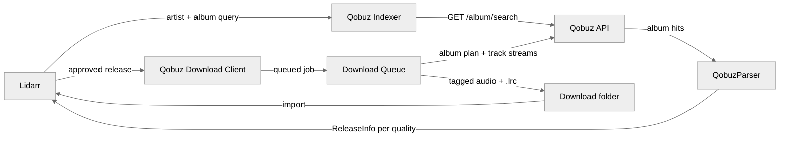

<h1 align="center">
  Qobuz for Lidarr 🎼
</h1>
<p align="center">
  A <strong>Lidarr plugin</strong> that <em>turns a Qobuz subscription into an automatically monitored Hi-Res library</em>.
</p>

<br>

## What is Qobuz for Lidarr?

Lidarr tracks the albums you care about and fetches them as they appear. Out of the box it only knows how to talk to torrent and Usenet indexers. This plugin registers Qobuz as both an **indexer** and a **download client**, so Lidarr can search the Qobuz catalogue and pull FLAC — up to 24-bit/192kHz — straight from it. Monitoring, quality profiles, renaming, and import all behave exactly as they do for any other source.

## Why use this? 🤔

A Qobuz subscription already grants you the catalogue, but nothing connects it to a library you actually keep. The usual alternative is a browser tab, a separate downloader, and manually dropping files where your music server can find them — repeated by hand every time an artist releases something.

With this plugin, adding an artist in Lidarr is the whole workflow. New releases are found, downloaded at the best quality your subscription allows, tagged, and filed automatically — with no second service to deploy, update, or debug when a download stalls.

## Features 🚀

- 🎚️ **Hi-Res FLAC:** publishes MP3 320, FLAC Lossless, and — where Qobuz marks an album Hi-Res streamable — FLAC 24-bit at 96kHz and 192kHz.
- 🔍 **Qobuz as a Lidarr indexer:** album searches run against Qobuz and return one release per quality, so Lidarr can grade them against your quality profiles.
- 📥 **Automatic grabbing:** monitored albums download without intervention, through Lidarr's normal queue and import pipeline.
- 🏷️ **Tags and cover art written on the way in:** title, album, artist, year, track and disc numbers, genre, and embedded artwork, so imports land clean.
- 📝 **Synced lyrics:** Qobuz supplies none, so [LRCLIB](https://lrclib.net) can be enabled as the provider, optionally writing a separate `.lrc` file.
- 🔒 **Downloads land atomically:** each track is written to a unique temporary file and moved into place only once complete, so an interrupted transfer never leaves a truncated track that looks importable.
- 🐢 **Bounded and cancellable:** three albums and three tracks in flight at a time, with a stall timeout, so a hung connection cannot wedge the queue.
- 📦 **Single-assembly install:** dependencies are merged into one DLL, so installing is one folder with one file in it.

## Architecture 🏗️



Note that the indexer and the download client are separate Lidarr providers, so configuring one does not configure the other. Credentials live in the **indexer** settings — the download client is handed the originating indexer by Lidarr and reads them from there.

## How to Install ⚡

### Prerequisites 📦

- A Lidarr instance on the [`plugins` branch](https://wiki.servarr.com/lidarr/installation) — plugins do not load on `master`.
- An active [Qobuz](https://www.qobuz.com/) subscription (Studio or above for Hi-Res).
- Your Qobuz password as an **MD5 hash**, not the password itself. [CyberChef](https://cyberchef.org/#recipe=MD5()&input=VGhpc0lzQVBhc3N3b3Jk) will produce one. Alternatively, supply a User ID and Auth Token instead.

A `docker-compose.yml` on the plugins branch looks like this:

```yml
services:
  lidarr:
    image: ghcr.io/hotio/lidarr:pr-plugins
    container_name: lidarr
    environment:
      - PUID=1000
      - PGID=1000
      - TZ=Etc/UTC
    volumes:
      - /path/to/config/:/config
      - /path/to/downloads/:/downloads
      - /path/to/music:/music
    ports:
      - 8686:8686
    restart: unless-stopped
```

### Installing the plugin 🔌

1. In Lidarr, go to `System -> Plugins`, paste the repository URL into the GitHub URL box, and press **Install**. Restart Lidarr when it asks you to.

   ```
   https://github.com/TrevTV/Lidarr.Plugin.Qobuz
   ```

2. Go to `Settings -> Indexers`, press **Add**, and choose **Qobuz** (under *Other*, at the bottom).

3. Enter your credentials, then press **Save**.
   - **Email + MD5 password:** put your email in **Qobuz Email** and the MD5 hash in **Qobuz Password (MD5)**.
   - **Or User ID + Auth Token:** paste each into its own box.
   - If both are supplied, the email and password win. Only one form is needed, and **Test** fails with a named reason when neither is complete.

4. Go to `Settings -> Download Clients`, press **Add**, and choose **Qobuz** (again under *Other*). Set **Download Path**, and press **Test** — that is what confirms the folder exists and is writable by the account running Lidarr.

5. Go to `Settings -> Profiles`, find **Delay Profiles**, click the wrench on each one, and toggle **Qobuz** on.

   Without this, every release is rejected with *"QobuzDownloadProtocol is not enabled for this artist."*

6. Optional but recommended: in `Settings -> Media Management`, enable **Rename Tracks** so each album lands in its own folder rather than loose in the artist directory.

7. Optional: to keep `.lrc` lyrics, enable **Import Extra Files** in the same screen and add `lrc` to the list.

### Settings 🔧

**Indexer**

| Setting | Default | Description |
| --- | --- | --- |
| `Qobuz Email` | — | Your account email. Needs `Qobuz Password (MD5)` alongside it. |
| `Qobuz Password (MD5)` | — | An **MD5 hash** of your password, not the password. |
| `User ID` | — | Alternative to email login. Needs `User Auth Token` alongside it. |
| `User Auth Token` | — | The other half of token login. If it fails, try setting `App ID` and `App Secret`. |
| `App ID` | optional | Qobuz app id. Leave empty to scrape the web player's values. |
| `App Secret` | optional | Required if `App ID` is set, and vice versa — one without the other is rejected. |
| `Early Download Limit` | none | Days before a release date that Lidarr may grab from this indexer. Advanced. |

**Download client**

| Setting | Default | Description |
| --- | --- | --- |
| `Download Path` | — | Where tracks are written before Lidarr imports them. Saving checks it is a valid path; **Test** additionally checks it exists and is writable. |
| `Save Synced Lyrics` | `false` | Writes a `.lrc` file when synced lyrics exist. Needs `lrc` in Import Extra Files. |
| `Use LRCLIB as Lyric Provider` | `false` | Qobuz supplies no lyrics, so enable this to fetch them from LRCLIB. |

## Testing 🧪

163 offline tests, with no network access and no credentials required — the Qobuz API sits behind a plugin-owned interface with an in-memory fake standing in for it.

```sh
dotnet test src/Lidarr.Plugin.Qobuz.Tests/Lidarr.Plugin.Qobuz.Tests.csproj \
  -p:NuGetAudit=false
```

`-p:NuGetAudit=false` is needed because the pinned `ext/Lidarr` submodule references a package with a published advisory and sets `TreatWarningsAsErrors`, which promotes the audit warning to a build error. It is upstream's dependency, not this plugin's.

Two traps worth knowing before adding tests, both documented in [`BUILD-NOTES.md`](BUILD-NOTES.md):

- **Await your async assertions.** A non-awaited `act.Should().ThrowAsync<T>()` returns an unobserved `Task` and never runs the assertion — on FluentAssertions 5.10.3 it passes even when the target throws nothing at all.
- **Tests run against the ILRepack-merged assembly,** in which the Qobuz library's types are internalised, so a test signature may not name one.

## Building from Source 🔨

```sh
git clone --recurse-submodules https://github.com/TrevTV/Lidarr.Plugin.Qobuz
cd Lidarr.Plugin.Qobuz
dotnet build src/*.sln -c Release -f net8.0 -p:NuGetAudit=false
```

> [!IMPORTANT]
> **Build the `.sln`, never the `.csproj`.** `ext/Lidarr` wires StyleCop up through
> `$(SolutionDir)`, which is empty for a project-only build, so `stylecop.json` is never
> loaded and the upstream tree fails with roughly 509 spurious `SA1200` errors.

Two further notes, both expanded in [`BUILD-NOTES.md`](BUILD-NOTES.md):

- **The submodules are required.** `ext/Lidarr` and `ext/QobuzApiSharp` are referenced as projects, so nothing compiles without `--recurse-submodules` (or a later `git submodule update --init`).
- **`src/global.json` pins the SDK to 8.0.x** with `rollForward: latestMinor`, which does not cross a major version. A machine with only .NET 9 or 10 installed reports *"A compatible .NET SDK was not found"* until you install .NET 8 alongside it.

A clean build reports **7 warnings, all inside `ext/QobuzApiSharp`** (obsolete serialization members on its exception types) and **none from this plugin's own code**. An incremental rebuild reports zero, because the submodule is not recompiled — so don't quote that number without qualification.

The result lands in `_plugins/net8.0/Lidarr.Plugin.Qobuz/`. Copy the `.dll`, `.pdb`, and `.deps.json` into `<lidarr-config>/plugins/TrevTV/Lidarr.Plugin.Qobuz/` and restart Lidarr. To have a local build deployed for you, pass a path:

```sh
dotnet build src/*.sln -c Release -f net8.0 -p:NuGetAudit=false \
  -p:QobuzPluginDeployPath=/path/to/lidarr/plugins/TrevTV/Lidarr.Plugin.Qobuz
```

## Known Limitations ⚠️

- **Hi-Res albums always offer 192kHz.** Qobuz marks an album Hi-Res streamable without saying which rate it will actually serve, so both 96kHz and 192kHz are published. Ask for 192 and Qobuz may hand back 96 — which is harmless, but the grabbed release is then labelled more optimistically than the file.
- **Search results estimate file size.** Qobuz exposes no cheap way to learn an album's byte size, so releases carry a figure derived from duration and bitrate. FLAC compresses, so the estimate runs high, and size-based custom formats act on an approximation. The real byte count replaces it once a download completes.
- **A partially-failed album is reported as failed.** If some tracks download and others do not, the whole release is marked `Failed` rather than imported in part. Lidarr can then blocklist it and look for another source — but the tracks that did arrive are not kept.
- **Only albums can be downloaded.** Qobuz track, artist, playlist, and label URLs are rejected at the point a release is grabbed, because Lidarr has no standalone-track entity and the download path needs an album.
- **Credentials are stored and displayed in clear text.** The MD5 password hash and the auth token are both full account credentials, so treat the Lidarr config and its API as sensitive.
- **Multiple Qobuz download clients are not fully supported.** Lidarr reassigns the active definition on a shared provider instance, so a second configured client can have its settings observed by the first. Settings are snapshotted at each entry point, which makes the single-client case correct; the general case cannot be fixed from inside a plugin.

## Architecture Notes 📐

[`ARCHITECTURE-PLAN.md`](ARCHITECTURE-PLAN.md) records the design of the current download pipeline, the host contracts it relies on, and the reasoning behind each decision — including the ones deliberately not taken. [`BUILD-NOTES.md`](BUILD-NOTES.md) covers the build environment's sharp edges. Start with both before changing the download queue, the session handling, or the release identity format.

## Licensing 📜

This plugin uses code from [QobuzDownloaderX-MOD](https://github.com/DJDoubleD/QobuzDownloaderX-MOD), which is **GPL-3.0**, and merges [QobuzApiSharp](https://github.com/TrevTV/QobuzApiSharp) — also **GPL-3.0** — into the shipped assembly, so the built artifact is bound by GPL-3.0 terms.

These libraries are merged into the final plugin assembly by ILRepack, to work around what appears to be a bug in Lidarr's plugin loader. Their terms travel with the built DLL:

| Library | License |
| --- | --- |
| [QobuzApiSharp](https://github.com/TrevTV/QobuzApiSharp) (forked from [DJDoubleD](https://github.com/DJDoubleD/QobuzApiSharp)) | [GPL-3.0](https://github.com/DJDoubleD/QobuzApiSharp/blob/master/LICENSE.txt) |
| [TagLibSharp](https://github.com/mono/taglib-sharp) | [LGPL-2.1](https://github.com/mono/taglib-sharp/blob/main/COPYING) |
| [Newtonsoft.Json](https://github.com/JamesNK/Newtonsoft.Json) | [MIT](https://github.com/JamesNK/Newtonsoft.Json/blob/master/LICENSE.md) |

---

Originally created by [TrevTV](https://github.com/TrevTV). Maintained with ❤️ by Joseph Marbella.
